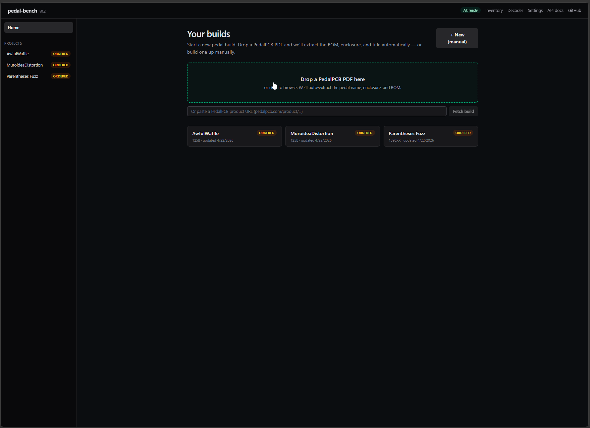
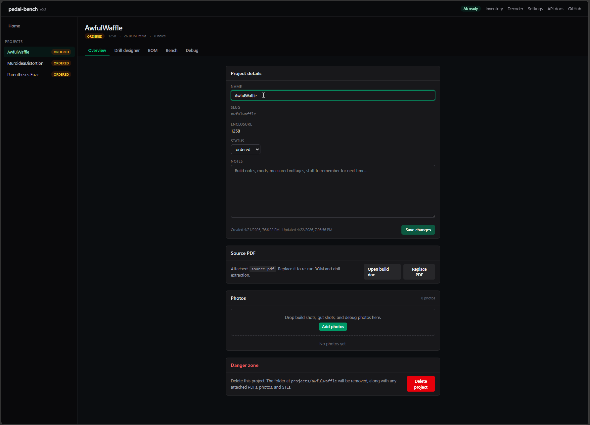
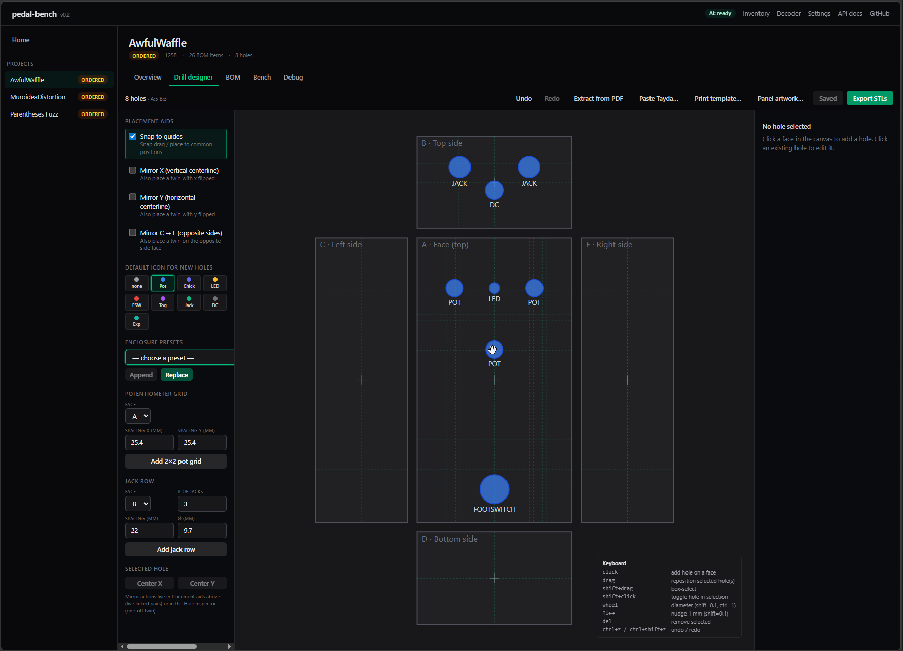
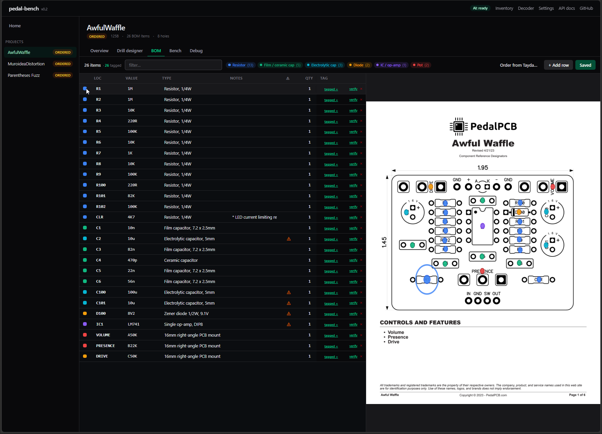
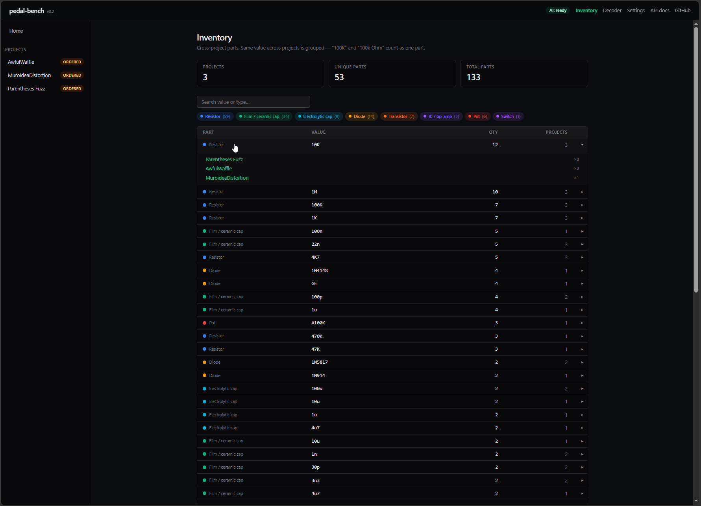
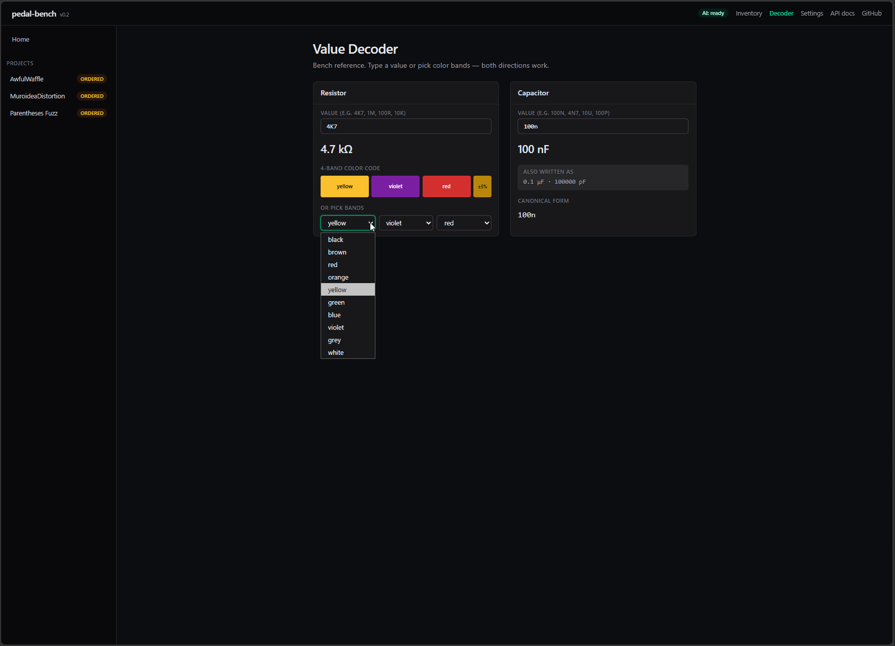
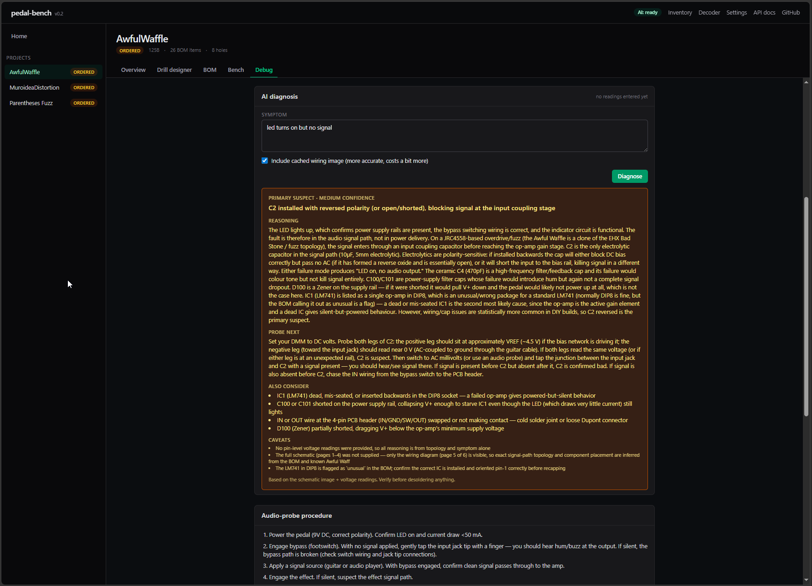

# pedal-bench

A local workbench for DIY guitar pedal builds. Drop a PedalPCB PDF or
paste a product URL — and walk through ordering, drilling, soldering,
and debugging in one place. Runs on your machine, stores your projects
as plain JSON in a folder you can back up.

**The whole tool works fully offline.** No account, no signup, no
phone-home. AI is **strictly optional** — four small features become
available if you bring an Anthropic API key, but everything else is
deterministic Python and TypeScript that runs without one.




## What pedal-bench does (without an API key)

Modern PedalPCB build docs have predictable vector layouts; we read
them with `pdfplumber` and never call an LLM. Drill geometry is
`build123d` math, not a language model "imagining" hole positions.
Color-band decoders are pure local arithmetic. Nearly the entire app
is deterministic by design.

### Ingestion

Drop a modern PedalPCB build PDF or paste a `pedalpcb.com/product/...`
URL. The tool fetches the build doc and pulls out title, enclosure,
BOM rows, drill template, and wiring diagram automatically. No AI
required for current PedalPCB layouts.

### Project overview

Per-build workspace with name, enclosure, status, free-form notes,
attached source PDF (re-runnable extraction), and a build-log photo
gallery. Everything saved as JSON under `projects/<slug>/`.



### Drill designer

SVG unfolded-enclosure canvas. Click to place holes, drag to
reposition, scroll-wheel to resize, multi-select with shift-drag,
undo/redo, live mirror groups. Smart-layout presets for pot grids and
jack rows. Paste Tayda Box-Tool coordinates directly. Export to
print-ready 1:1 mm SVG/PNG (with crosshairs for center-punching) or
one-click parametric STL drill guides via `build123d` for 3D printing.



### BOM editor with PCB layout

Dense inline-editable table, color-coded chips by component kind
(resistor / cap / electrolytic / diode / transistor / IC / pot), click
any row to highlight that part on the cached PCB layout, polarity
warnings on orientation-sensitive rows. Filter chips group by kind so
you can scan all the resistors at once.



### Bench mode

Grouped build-along checklist in solder order. Polarity warnings on
diodes, electrolytics, and transistors. Filters for "polarity only"
and "pending only," plus a live progress bar.

### Debug helper

Per-IC expected pin voltages for 7 seed chips, with live "ok / out of
range" highlighting as you type measurements. Audio-probe procedure.
Common-failure triage organized by symptom. All of this is bench
reference data shipped with the app, no LLM involved.

### Cross-project inventory

Inventory page shows every unique part across all your projects with
totals — "100K resistor: 12 across 3 projects" — and click any row to
drill into which projects use it. Value normalization means "100K" and
"100k Ohm" count as one part. Backed by a SQLite index rebuilt on
demand from your JSON project store.



### Order from Tayda

One-click dialog dedupes your BOM by part, tailors per-kind search
queries (resistor, cap, pot, IC), and opens Tayda search-result tabs
in batches of 5. Per-part "ordered" checkboxes save shopping progress
per project across sessions. (Tayda is the only supplier integration
right now — Mouser's "free" API requires sales approval, so it's not
viable for hobbyists; we're watching DigiKey/Octopart instead.)

### Value decoder

Bidirectional resistor decoder (text ↔ "4K7" ↔ 4-band colors) and
capacitor decoder (100n ↔ 0.1µF ↔ 100000pF). Pure TypeScript, zero
latency, fully offline.



## Quickstart

```bash
git clone https://github.com/ChrisCrouse/pedal-bench
cd pedal-bench
npm install        # workspace tools (concurrently)
npm run setup      # creates .venv, pip-installs backend, npm-installs frontend
npm run dev        # starts both servers in one terminal
```

Open **http://127.0.0.1:5173** in your browser.

The first `setup` pulls ~300 MB of CAD bindings (`build123d` needs Open
CASCADE) and takes a few minutes. After that, `npm run dev` starts in
seconds.

## Requirements

- Python 3.12 or 3.13 (3.14 isn't supported yet — `pypdfium2` / `build123d` don't ship 3.14 wheels)
- Node.js LTS (18+, tested with 24.15)
- Optional: 3D printer for parametric drill guides (PLA / PETG). Without
  one, use the print-ready 1:1 template instead — tape, center-punch,
  drill.

Tested on Windows 10/11 daily; macOS / Linux should work but aren't tested.

## A note on AI: it's a bonus, not a gate

Online pushback against AI features in DIY tools is real and has good
reasons behind it: cost, lock-in, opacity, environmental concerns, and
the LLM-shaped hammer treating every problem as a nail.

pedal-bench's rule is **deterministic-first, AI as augmentation, never
as a gate**. The whole feature set above runs without an API key, no
signup, no internet beyond ordering parts. We hide AI surfaces from the
UI entirely when no key is configured — no amber nags, no disabled
buttons, no "upgrade to unlock" prompts. The header pill goes neutral
zinc "AI: off" instead of begging for a key.

If you want the AI extras described below, add a key. If you don't,
**you are not missing the core of pedal-bench.** The capabilities panel
on the Settings page lays this out plainly so prospective users can
make an informed choice.

### What a key adds (four optional features)

| Feature | What it adds | Cost (typical) |
|---|---|---|
| **BOM extraction fallback** | Reads older PedalPCB "Parts List" PDFs that the deterministic table parser can't handle. Only fires when deterministic parsing returns zero rows. | ~$0.01 per PDF |
| **Drill template fallback** | Extracts hole positions from image-only or unusually laid-out drill pages. Only fires when vector extraction returns nothing. | ~$0.01 per PDF |
| **Component photo verification** | Per-row Verify button on the BOM tab. Snap a photo, get a match / mismatch / unsure verdict before soldering. | ~$0.005–0.01 per check |
| **AI fault diagnosis** | Debug-tab card. Reasons over your symptom + measured pin voltages + cached wiring image; suggests what to probe next. Schematic prompt caching makes repeat calls cheaper. | ~$0.02–0.05 per call |

Typical usage is **$1–5 per active build**. **[Set a usage
limit](https://console.anthropic.com/settings/limits)** before heavy
use — a runaway loop on pay-as-you-go can cost more.

The diagnosis card looks like this when active — a symptom box, your
pin readings auto-attached, and a structured response with primary
suspect, reasoning, what to probe next, and caveats:



### Adding a key (only if you want the four features above)

Two ways to provide one:

1. **Self-host:** copy `backend/.env.example` to `backend/.env` and set
   `ANTHROPIC_API_KEY`. Loaded at backend startup.
2. **Bring-your-own-key (BYOK):** paste your key into **Settings** in
   the web UI. Stored in your browser's localStorage, sent as a request
   header on every API call, **never persisted server-side.**

Get a key at
[console.anthropic.com/settings/keys](https://console.anthropic.com/settings/keys).

The header pill in the screenshot above shows status: emerald **AI:
ready** / **AI: your key** when configured, neutral zinc **AI: off**
when not. The "off" state is a calm signpost, not a nag.

## Other commands

```bash
npm run dev:backend    # only FastAPI
npm run dev:frontend   # only Vite
npm run test           # Python test suite
npm run typecheck      # tsc --noEmit on the frontend
npm run build          # production build of the frontend
```

A `Makefile` is provided for git bash / WSL users with the same targets.

## Architecture

- **Backend** — Python 3.12/3.13 · FastAPI · `build123d` (parametric STL) ·
  `pdfplumber` (BOM + vector layout) · `pypdfium2` (page rasterization)
  · `Pillow` · `anthropic` (optional AI features). Lives in [backend/](./backend/).
- **Frontend** — React 19 · TypeScript 5 · Vite 6 · Tailwind v4 ·
  TanStack Query · native SVG canvas (no Canvas/Konva/Fabric). Lives
  in [frontend/](./frontend/).
- **Storage** — JSON-per-project on disk. Per-user, per-machine.

See [docs/architecture.md](./docs/architecture.md) for the stack
decision record.

## Repo layout

```
pedal-bench/
├── backend/
│   ├── pyproject.toml
│   ├── .env.example                  # template — copy to .env if self-hosting
│   ├── pedal_bench/
│   │   ├── api/
│   │   │   ├── app.py
│   │   │   ├── deps.py
│   │   │   ├── schemas.py
│   │   │   └── routes/               bom · debug · diagnose · enclosures
│   │   │                             holes · pdf · photos · projects · stl
│   │   │                             tayda · verify_component · ai_status
│   │   ├── core/                     models, stores, decoders, hint library
│   │   ├── io/                       PedalPCB extractors (deterministic + AI)
│   │   │                             Tayda coords, PDF→image, STL builder
│   │   └── data/                     enclosures, suppliers, orientation hints,
│   │                                 debug topologies
│   └── tests/                        162 pytest cases
├── frontend/
│   └── src/
│       ├── api/                      typed API client (BYOK header injection)
│       ├── components/
│       │   ├── bom/                  table, PCB layout viewer, verify dialog
│       │   ├── debug/                AI diagnosis card
│       │   ├── drill/                canvas geometry, smart layouts, Tayda
│       │   │                         paste, panel artwork, drill template
│       │   ├── overview/             photos section
│       │   ├── pdf/                  drop zone + review modal
│       │   └── ui/                   buttons, inputs, dialog, AI status pill
│       ├── layout/                   app shell (sidebar + header)
│       ├── lib/                      apiKey storage, decoders TS port
│       └── pages/                    Home · Project · Decoder · Settings
├── projects/                         per-build folders (your data, gitignored)
├── docs/
│   └── architecture.md
├── package.json                      workspace scripts
├── LICENSE                           MIT
└── README.md
```

## Tests

```bash
npm run test
```

Backend tests cover value decoders, PedalPCB BOM extraction
(deterministic + AI parser logic), cross-project SQLite inventory
index, Tayda coordinate parsing, STL
generation (watertight meshes + bbox assertions), URL fetcher, AI drill
/ BOM / diagnosis / component-verify parsers. Drop a real PedalPCB PDF
at `backend/tests/fixtures/sherwood.pdf` to enable the end-to-end BOM
integration test (otherwise auto-skipped).

Frontend typecheck: `npm run typecheck`.

## Roadmap

- [x] v1 tkinter MVP (Phases 0–3)
- [x] v2 web UI — drill designer, BOM, bench mode, debug, decoder
- [x] One-drop / paste-a-URL ingestion + AI fallback for older PDFs
- [x] AI component verification + AI fault diagnosis
- [x] Print-ready drill template (with crosshairs) + build-log photos
- [x] BYOK + public release
- [x] SQLite-backed cross-project inventory (Inventory page)
- [x] First-class no-AI-key experience (hidden surfaces, neutral pill, capabilities panel)
- [ ] DigiKey or Octopart integration (free public APIs — Mouser's "free" tier requires sales approval, removed)
- [ ] Community-corroborated BOMs (requires hosted backend)
- [ ] Optional hosted instance for non-technical builders

## License

MIT — see [LICENSE](./LICENSE).
